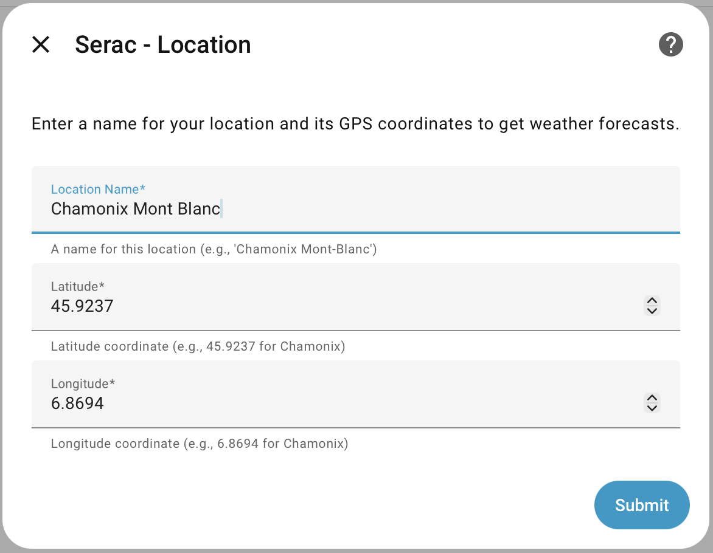
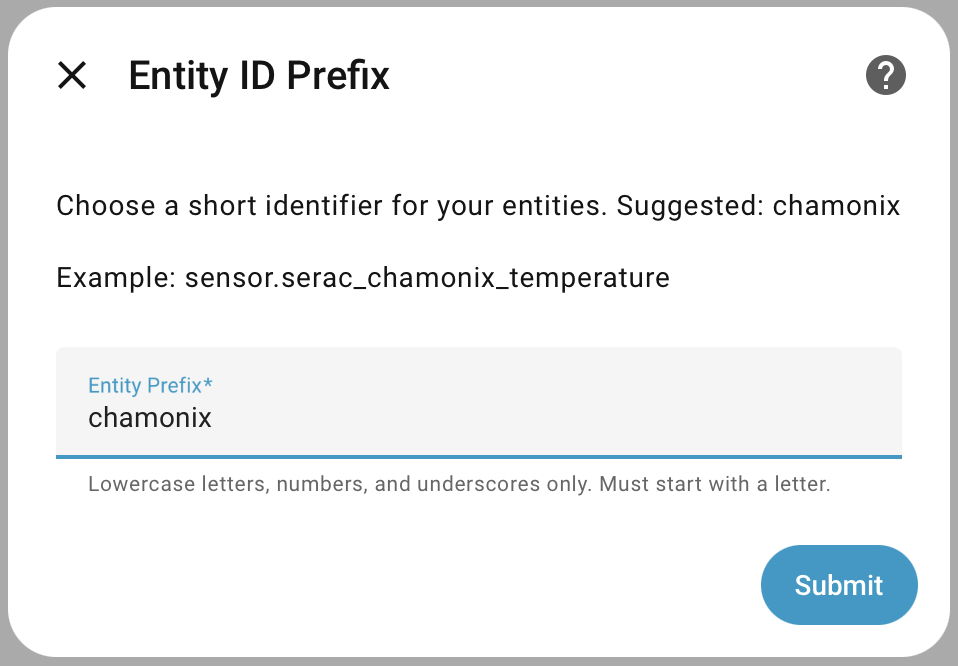
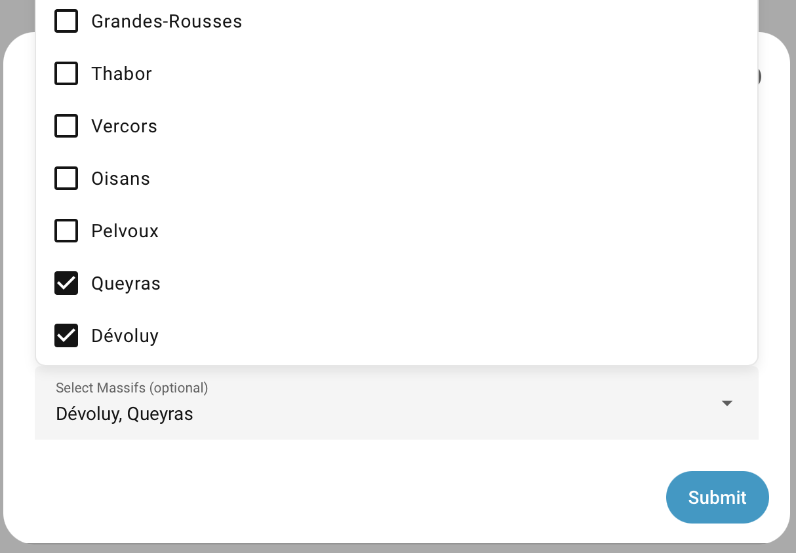
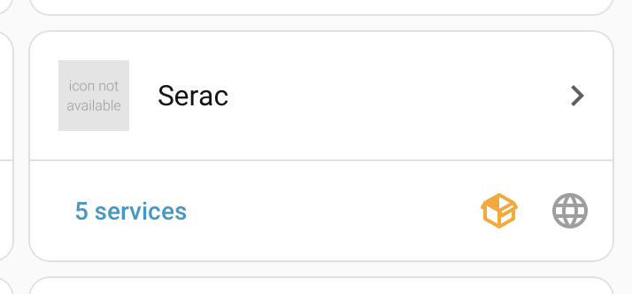

<p align="center">
  
</p>

# Serac 🏔️

[](https://github.com/custom-components/hacs)
[](https://github.com/atacamalabs/ha-serac/releases)
[](LICENSE)

**Mountain weather and avalanche forecasts for Home Assistant**

Serac is a comprehensive Home Assistant integration providing detailed mountain weather data and avalanche bulletins for the French Alps, Pyrenees, and Corsica. Get accurate forecasts from Météo-France AROME/ARPEGE models and real-time avalanche risk assessments.

---

## Features

### 🌤️ Weather Data
- **Weather entity** with 7-day daily and 48-hour hourly forecasts
- **51 weather sensors** including:
  - Current conditions (temperature, humidity, wind, precipitation, cloud coverage)
  - 3-day detailed forecasts (13 parameters per day)
  - Sunrise/sunset, UV index, sunshine duration
  - Hourly precipitation forecasts

### 🌫️ Air Quality
- **6 air quality sensors** with 5-day forecasts:
  - European Air Quality Index (AQI)
  - PM2.5, PM10, NO₂, O₃, SO₂ levels

### ⚠️ Avalanche Bulletins
- **8 avalanche sensors per massif**:
  - Risk levels (today & tomorrow, 1-5 scale)
  - High/low altitude risk zones
  - Accidental & natural avalanche descriptions
  - Bulletin summaries and dates
- **Multiple massifs support** - select 0-11 massifs from Haute-Savoie/Savoie regions
- **Separate device per massif** for clear organization

### 🎯 Smart Entity Naming
- **User-defined entity prefix** for clean, memorable entity IDs
- Example: `sensor.serac_chamonix_temperature`
- Avalanche sensors include massif: `sensor.serac_chamonix_aravis_avalanche_risk_today`

---

## Installation

### Via HACS (Recommended)

1. Open HACS in Home Assistant
2. Click on **Integrations**
3. Click the **⋮** (three dots) in the top right
4. Select **Custom repositories**
5. Add repository URL: `https://github.com/atacamalabs/ha-serac`
6. Select category: **Integration**
7. Click **Add**
8. Find **Serac** in HACS and click **Download**
9. **Restart Home Assistant**
10. Go to **Settings** → **Devices & Services** → **Add Integration**
11. Search for **Serac** and follow the setup steps

### Manual Installation

1. Download the `custom_components/serac` folder from this repository
2. Copy it to your Home Assistant `config/custom_components/` directory
3. Restart Home Assistant
4. Go to **Settings** → **Devices & Services** → **Add Integration**
5. Search for **Serac**

---

## Configuration

### Setup Steps

Serac uses a simple 3-step configuration flow:

#### Step 1: Location Setup
- Enter a name for your location (e.g., "Chamonix Mont-Blanc")
- Enter GPS coordinates (latitude, longitude)
- Example: Chamonix (45.9237, 6.8694)



#### Step 2: Entity Prefix
- Choose a short identifier for your entities
- Suggested automatically from your location name
- Used in entity IDs: `sensor.serac_{your_prefix}_temperature`



#### Step 3: Avalanche Data (Optional)
- Add Météo-France BRA API token (optional)
- Select massifs for avalanche bulletins (0-35 massifs)
- Skip if you only want weather data



#### Configuration Complete!
Once configured, Serac appears in your Devices & Services with a custom logo.



### Finding GPS Coordinates

- **Google Maps**: Right-click on location → Click coordinates to copy
- **OpenStreetMap**: [openstreetmap.org](https://www.openstreetmap.org/)
- **Your Phone**: Use GPS app to get current coordinates

### Getting BRA API Token (Optional)

For avalanche bulletins, you need a Météo-France BRA API token:

1. Visit [Météo-France API Portal](https://portail-api.meteofrance.fr/)
2. Create an account
3. Subscribe to the **BRA (Bulletin Risque Avalanche)** API
4. Copy your API key
5. Enter it during Serac setup or leave empty to skip avalanche features

---

## Supported Massifs

All French massifs are now supported for avalanche bulletins! 🎉

### French Alps (23 Massifs)

**Northern Alps:**
- Chablais • Aravis • Mont-Blanc • Bauges • Beaufortain
- Haute-Tarentaise • Chartreuse • Belledonne • Maurienne
- Vanoise • Haute-Maurienne • Grandes-Rousses • Thabor
- Vercors • Oisans • Pelvoux

**Southern Alps:**
- Queyras • Dévoluy • Champsaur • Embrunais-Parpaillon
- Ubaye • Mercantour • Alpes-Azur

### Pyrenees (11 Massifs)

- Pays-Basque • Aspe-Ossau • Haute-Bigorre • Aure-Louron
- Luchonnais • Couserans • Haute-Ariège • Orlu-St-Barthélémy
- Capcir-Puymorens • Cerdagne-Canigou • Andorre

### Corsica (1 Massif)

- Corse

**Total: 35 massifs supported** across all French mountain ranges!

---

## Usage Examples

### Weather Card

Add a weather forecast card to your Lovelace dashboard:

```yaml
type: weather-forecast
entity: weather.serac_chamonix
forecast_type: daily
```

### Sensor Cards

Display current mountain conditions:

```yaml
type: entities
title: Mountain Conditions - Chamonix
entities:
  - entity: sensor.serac_chamonix_temperature
  - entity: sensor.serac_chamonix_humidity
  - entity: sensor.serac_chamonix_wind_speed_current
  - entity: sensor.serac_chamonix_wind_gust_current
  - entity: sensor.serac_chamonix_european_aqi
  - entity: sensor.serac_chamonix_elevation
```

### Avalanche Risk Card

Monitor avalanche conditions for a specific massif:

```yaml
type: entities
title: Avalanche Risk - Aravis
entities:
  - entity: sensor.serac_chamonix_aravis_avalanche_risk_today
  - entity: sensor.serac_chamonix_aravis_avalanche_risk_tomorrow
  - entity: sensor.serac_chamonix_aravis_avalanche_risk_high_altitude
  - entity: sensor.serac_chamonix_aravis_avalanche_risk_low_altitude
  - entity: sensor.serac_chamonix_aravis_avalanche_accidental
```

### Automation: High Wind Alert

```yaml
automation:
  - alias: "Mountain High Wind Alert"
    trigger:
      - platform: numeric_state
        entity_id: sensor.serac_chamonix_wind_gust_max_day0
        above: 60
    action:
      - service: notify.mobile_app
        data:
          title: "⚠️ High Wind Warning"
          message: "Wind gusts expected to exceed 60 km/h today in Chamonix!"
```

### Automation: Avalanche Risk Alert

```yaml
automation:
  - alias: "High Avalanche Risk Alert"
    trigger:
      - platform: numeric_state
        entity_id: sensor.serac_chamonix_aravis_avalanche_risk_today
        above: 3
    action:
      - service: notify.mobile_app
        data:
          title: "⚠️ Avalanche Warning"
          message: "Avalanche risk level {{ states('sensor.serac_chamonix_aravis_avalanche_risk_today') }} in Aravis today!"
```

---

## Data Sources

- **Weather Forecasts**: [Open-Meteo](https://open-meteo.com/) (Météo-France AROME 2.5km & ARPEGE models)
- **Avalanche Bulletins**: [Météo-France BRA](https://meteofrance.com/meteo-montagne) (Bulletin Risque Avalanche)
- **Air Quality**: Open-Meteo European AQI

All data is provided by **Météo-France**, the French national meteorological service.

---

## Update Frequency

- **Weather Data**: Every 1 hour
- **Air Quality**: Every 1 hour
- **Avalanche Bulletins**: Every 6 hours (published once daily)

---

## Migrating from v0.6.0

**⚠️ Breaking change:** Serac v1.0.0 requires a complete reinstall.

See **[MIGRATION_v1.md](MIGRATION_v1.md)** for detailed migration instructions.

**Quick summary:**
1. Remove old "Better Mountain Weather" integration
2. Remove old HACS repository
3. Restart Home Assistant
4. Add new repository: `https://github.com/atacamalabs/ha-serac`
5. Install Serac and reconfigure
6. Update automations and dashboards with new entity IDs

---

## Troubleshooting

### Integration doesn't appear after installation

**Symptoms**: Can't find "Serac" when adding a new integration

**Solutions**:
1. **Restart Home Assistant completely** (not just reload integrations)
   - Go to **Settings** → **System** → **Restart**
2. **Verify installation**:
   - Check that `custom_components/serac/` folder exists
   - Verify `manifest.json` is present in that folder
3. **Check logs** for errors:
   - **Settings** → **System** → **Logs**
   - Filter by "serac" to find integration-specific errors
4. **Clear browser cache** - Sometimes the UI doesn't refresh properly

### Weather data not updating

**Symptoms**: Sensors stuck on old values, no updates for hours

**Solutions**:
1. **Check coordinator status**:
   - Go to **Developer Tools** → **States**
   - Find `sensor.serac_{prefix}_temperature` and check `last_updated` timestamp
2. **Reload the integration**:
   - **Settings** → **Devices & Services** → **Serac** → **⋮** → **Reload**
3. **Check internet connection** - Open-Meteo API must be accessible
4. **Verify coordinates**:
   - Ensure latitude/longitude are valid numbers
   - Check you're not in a region without coverage (unlikely)
5. **Check logs** for API errors:
   ```bash
   tail -f /config/home-assistant.log | grep serac
   ```
6. **Wait for next update cycle** - Weather updates every 1 hour

**If problem persists**: Download diagnostics (**Devices** → **Serac** → **Download Diagnostics**) and open a GitHub issue.

### Avalanche sensors not appearing

**Symptoms**: No `avalanche_risk_*` sensors despite selecting massifs

**Solutions**:
1. **Verify BRA token is entered**:
   - Go to **Settings** → **Devices & Services** → **Serac** → **Configure**
   - Ensure BRA token field is filled
2. **Verify massifs are selected**:
   - In Configure, check that at least one massif is selected
3. **Check if bulletins are published** (seasonal):
   - Avalanche bulletins typically run **December to May**
   - Outside this period, sensors may show "Unknown" or not appear
4. **Test your BRA token**:
   - Log into [Météo-France API Portal](https://portail-api.meteofrance.fr/)
   - Verify your BRA API subscription is active
5. **Check BRA coordinator logs**:
   ```bash
   tail -f /config/home-assistant.log | grep -i "bra\|avalanche"
   ```
   - Look for "401 Unauthorized" (invalid token) or "404 Not Found" (out of season)
6. **Try a different massif** - Some massifs start/end season earlier than others

**Common log messages**:
- `"BRA bulletin not available for massif X (out of season?)"` → Normal outside winter
- `"HTTP error 401"` → Invalid/expired BRA token
- `"HTTP error 404"` → Bulletin not published yet

### Entity IDs don't match examples

**Symptoms**: Can't find sensors with expected names

**Explanation**: Entity IDs use your **custom prefix**, not "chamonix" from examples.

**Solutions**:
1. **Find your actual prefix**:
   - Go to **Settings** → **Devices & Services** → **Serac**
   - Look at your device name: "{Location Name} (Serac)"
   - Your prefix was chosen during setup (step 2)
2. **Find all Serac entities**:
   - **Developer Tools** → **States**
   - Filter by `serac` to see all entities
3. **Example prefix mapping**:
   - Prefix `home` → `sensor.serac_home_temperature`
   - Prefix `my_chalet` → `sensor.serac_my_chalet_temperature`
   - Prefix `mtblanc` → `sensor.serac_mtblanc_temperature`

### "Cannot connect" error during setup

**Symptoms**: Setup fails at step 1 with connection error

**Solutions**:
1. **Check coordinate format**:
   - ✅ Correct: `45.9237` (decimal)
   - ❌ Wrong: `45° 55' 25"` (degrees/minutes/seconds)
   - ❌ Wrong: `45,9237` (comma instead of period)
2. **Verify internet connection**:
   - Test from terminal: `curl -s "https://api.open-meteo.com/v1/forecast?latitude=45.9237&longitude=6.8694&current=temperature_2m"`
   - Should return JSON data
3. **Try known coordinates**:
   - Chamonix: `45.9237, 6.8694`
   - Grenoble: `45.1885, 5.7245`
   - Paris: `48.8566, 2.3522`
4. **Check Home Assistant's network access**:
   - If running in Docker, verify network mode allows outbound connections
   - If using a firewall, ensure `api.open-meteo.com` is allowed
5. **Check Open-Meteo status**:
   - Visit [open-meteo.com](https://open-meteo.com/) to verify service is online

### Sensors showing "Unknown" or "Unavailable"

**Symptoms**: Sensors exist but show no data

**Causes & Solutions**:

**Weather sensors**:
- **Cause**: API coordinator failed to fetch data
- **Solution**: Check logs, verify internet, reload integration

**Avalanche sensors**:
- **Cause 1**: Out of season (most common)
  - **Solution**: Wait for winter season (~December-May)
- **Cause 2**: No bulletin published yet today
  - **Solution**: Météo-France publishes around 16:00-17:00 CET, wait a few hours
- **Cause 3**: Invalid BRA token
  - **Solution**: Update token via **Configure**

### High memory usage or slow performance

**Symptoms**: Home Assistant using excessive memory after adding Serac

**Unlikely but possible**:
- Serac fetches modest amounts of data (a few KB per update)
- If experiencing issues:
  1. Check how many massifs you've selected (each adds 8 sensors)
  2. Consider reducing massif count if you selected 10+
  3. Verify no other integrations are causing issues

### Integration won't uninstall/remove

**Symptoms**: Can't delete Serac from Devices & Services

**Solutions**:
1. **Remove the integration** first:
   - **Settings** → **Devices & Services** → **Serac** → **⋮** → **Delete**
2. **Then remove from HACS**:
   - **HACS** → **Integrations** → **Serac** → **⋮** → **Remove**
3. **Restart Home Assistant**
4. **Manually delete folder** (if needed):
   - Remove `config/custom_components/serac/`
   - Restart again

---

### Still need help?

If none of these solutions work:

1. **Enable debug logging**:
   ```yaml
   # configuration.yaml
   logger:
     default: info
     logs:
       custom_components.serac: debug
   ```
   Restart Home Assistant to apply logging changes.

2. **Download diagnostics** (v1.4.0+):
   - Go to **Settings** → **Devices & Services** → **Serac**
   - Click the **⋮** menu → **Download Diagnostics**
   - This exports a JSON file containing:
     - Configuration data (BRA token redacted for security)
     - Coordinator status (last update times, success/failure)
     - Entity and device counts
     - No personal data or coordinates
   - Attach this file when opening an issue

3. **Open a GitHub issue** with:
   - Diagnostic file (from step 2)
   - Relevant log excerpts (from step 1)
   - Home Assistant version
   - Description of what you tried
   - [GitHub Issues](https://github.com/atacamalabs/ha-serac/issues)

---

## Frequently Asked Questions

### Can I change my massif selection after setup?

**Yes!** Go to **Settings** → **Devices & Services** → **Serac** → **Configure** to add or remove massifs without reinstalling the integration. You can also update your BRA API token here.

### Why aren't avalanche sensors appearing?

Check these common causes:

1. **No BRA token provided** - Avalanche data requires a Météo-France BRA API token
2. **No massifs selected** - You must select at least one massif during setup or via Configure
3. **Out of season** - Avalanche bulletins are typically published December-May only
4. **Invalid token** - Verify your token at [Météo-France API Portal](https://portail-api.meteofrance.fr/)
5. **Check logs** - Look for BRA coordinator errors in Home Assistant logs

### How do I get multiple locations?

Add the Serac integration multiple times with different coordinates. Use unique entity prefixes for each location to keep sensors organized.

**Example:**
- Location 1: Chamonix (prefix: `chamonix`) → `sensor.serac_chamonix_temperature`
- Location 2: Zermatt (prefix: `zermatt`) → `sensor.serac_zermatt_temperature`

### Can I use Serac outside France?

**Partially:**
- ✅ **Weather data works worldwide** - Open-Meteo provides global coverage
- ✅ **Air quality works worldwide** - European AQI available globally
- ❌ **Avalanche bulletins only work for French massifs** - Météo-France BRA API limitation

### What's the difference between the risk sensors?

- **`avalanche_risk_today` / `avalanche_risk_tomorrow`** - Overall risk level (1-5 scale) for the day
- **`avalanche_risk_high_altitude` / `avalanche_risk_low_altitude`** - Risk descriptions for different elevation zones (text)
- **`avalanche_accidental` / `avalanche_natural`** - Descriptions of expected avalanche types

The "today/tomorrow" sensors give you the headline number, while altitude and type sensors provide detailed context.

### How often does data update?

- **Weather data**: Every 1 hour
- **Air quality**: Every 1 hour
- **Avalanche bulletins**: Every 6 hours (Météo-France publishes once daily, typically morning)

### Can I change the update frequency?

Not currently. Update intervals are optimized for API rate limits and data freshness. Custom intervals may be added in a future release.

### Do I need separate API keys for weather and avalanche data?

No! Weather and air quality data from Open-Meteo requires **no API key**. Only avalanche bulletins require a Météo-France BRA API token (free with registration).

### Why is my HACS entity called "a_better_mountain_weather_update"?

This is cosmetic only - HACS generates update entity IDs from the repository name at installation time. The entity's friendly name correctly shows "Serac update" and it functions normally. This doesn't affect any Serac sensors or functionality.

### Where can I get help?

- 🐛 **Bug reports**: [GitHub Issues](https://github.com/atacamalabs/ha-serac/issues)
- 💬 **Questions**: [GitHub Discussions](https://github.com/atacamalabs/ha-serac/discussions)
- 📧 **Email**: hi@atacamalabs.com

---

## Contributing

Contributions are welcome! Please:
1. Fork the repository
2. Create a feature branch
3. Make your changes
4. Submit a pull request

See **[CONTRIBUTING.md](CONTRIBUTING.md)** for detailed development guidelines.

### Feature Requests & Bug Reports
- **Issues**: [GitHub Issues](https://github.com/atacamalabs/ha-serac/issues)
- **Discussions**: [GitHub Discussions](https://github.com/atacamalabs/ha-serac/discussions)

---

## Roadmap

### Planned Features
- [ ] Options flow (change massifs without reinstalling)
- [ ] Support for all 40+ French massifs
- [ ] Custom logo and branding
- [ ] Enhanced error handling and diagnostics
- [ ] Multi-language support (French, German, Italian)
- [ ] Snow depth sensors
- [ ] Hourly avalanche risk evolution

---

## License

[MIT License](LICENSE)

---

## Acknowledgments

- **Météo-France** for providing excellent weather and avalanche data APIs
- **Open-Meteo** for API access to Météo-France models
- Home Assistant community for development support

---

## Disclaimer

This integration provides weather and avalanche information **for informational purposes only**. Always consult official sources and professional mountain guides before making decisions in mountain environments.

**The authors are not responsible for any incidents resulting from use of this data.**

---

## Support

- 🐛 **Bug reports**: [GitHub Issues](https://github.com/atacamalabs/ha-serac/issues)
- 💬 **Questions**: [GitHub Discussions](https://github.com/atacamalabs/ha-serac/discussions)
- 📧 **Email**: hi@atacamalabs.com

---

**Made with ❤️ for the mountain community**

*Serac: Named after the ice formations found in glaciers and mountain environments.*
